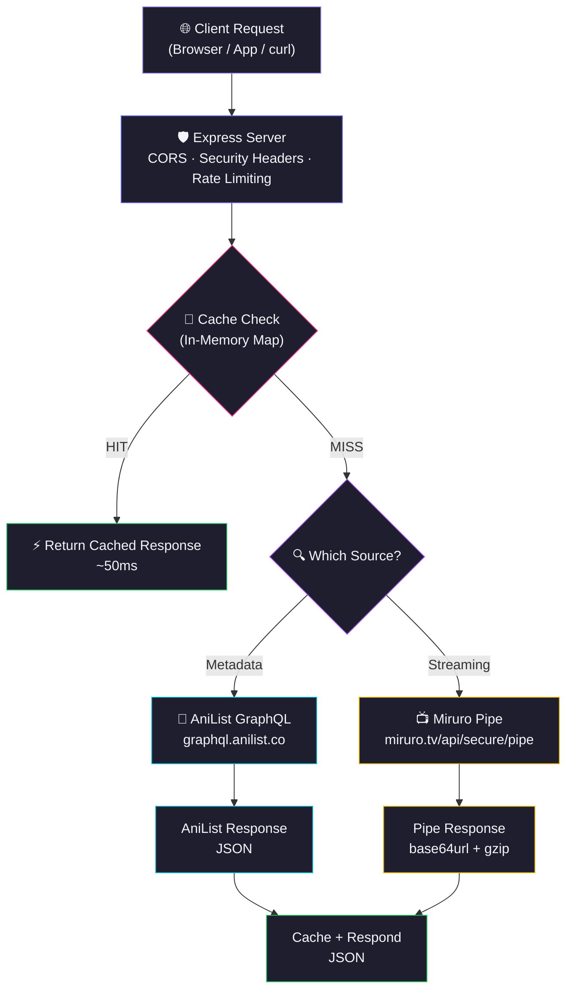
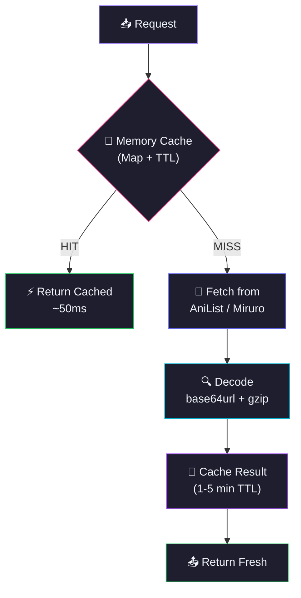

<div align="center">
  
  

</div>

<p align="center">
  <a href="https://github.com/Shineii86/MiruroAPI/stargazers"></a>
  <a href="https://github.com/Shineii86/MiruroAPI/network/members"></a>
  <a href="https://github.com/Shineii86/MiruroAPI/issues"></a>
  <a href="https://github.com/Shineii86/MiruroAPI/pulls"></a>
  <a href="https://github.com/Shineii86/MiruroAPI/commits"></a>
  <a href="https://github.com/Shineii86/MiruroAPI/blob/main/LICENSE"></a>
</p>

<p align="center">
  
  
  
  
  
  
  
  
</p>

<p align="center">
  <b>A complete RESTful API for anime streaming data powered by AniList GraphQL and Miruro providers</b><br/>
  Search, browse, filter, watch — every endpoint returns fresh data with smart caching.<br/>
  18 endpoints, 12 streaming providers, M3U8 URLs with subtitles and skip timestamps.
</p>

<p align="center">
  <a href="#-table-of-contents">Table of Contents</a> &bull;
  <a href="#-features">Features</a> &bull;
  <a href="#-api-endpoints">API Docs</a> &bull;
  <a href="#-quick-start">Quick Start</a> &bull;
  <a href="#-deployment">Deployment</a> &bull;
  <a href="#-contributing">Contributing</a>
</p>

---

> [!WARNING]
> 1. This `API` does not store any files — it only links to media hosted on 3rd party services.
> 2. This `API` is explicitly made for **educational purposes only** and not for commercial usage. This repo will not be responsible for any misuse of it.
> 3. All anime data, images, and content belong to their respective owners (AniList, Miruro). This project is not affiliated with miruro.tv.

---

## 📖 Table of Contents

- [Overview](#-overview)
- [Features](#-features)
- [Data Sources](#-data-sources)
- [Tech Stack](#-tech-stack)
- [Architecture](#-architecture)
- [Project Structure](#-project-structure)
- [Quick Start](#-quick-start)
- [Configuration](#-configuration)
- [API Endpoints](#-api-endpoints)
- [Streaming Flow](#-streaming-flow)
- [API Response Schema](#-api-response-schema)
- [Deployment](#-deployment)
- [Available Scripts](#-available-scripts)
- [Performance](#-performance)
- [Changelog Highlights](#-changelog-highlights)
- [Troubleshooting](#-troubleshooting)
- [FAQ](#-faq)
- [Roadmap](#-roadmap)
- [Contributing](#-contributing)
- [Acknowledgements](#-acknowledgements)
- [License](#-license)
- [Author](#-author)
- [Star History](#-star-history)

---

## 🌸 Overview

**MiruroAPI** is a serverless anime data API that fetches real-time information from **AniList GraphQL** and streaming data from **Miruro providers** — including anime details, episode lists, M3U8 streaming URLs with subtitles and skip timestamps, search, filtering, characters, and more — all through a clean REST API with zero database.

> 💡 No database, no auth, no complex setup. Just deploy to Vercel and you have a production API.

### Why MiruroAPI?

- 🎬 **18 Endpoints** — Complete anime data coverage
- 🔍 **Full-Text Search** — Search anime by keyword with suggestions
- 🎭 **Characters & Voice Actors** — Full character data from AniList
- 🎯 **Advanced Filtering** — Genre, year, season, format, sort
- 🏆 **Trending & Popular** — Discover what's hot right now
- 📅 **Airing Schedule** — See what's airing on any date
- 📡 **12 Streaming Providers** — M3U8 streaming sources
- ⏭️ **Skip Timestamps** — OP/ED skip data
- ⚡ **Smart Caching** — In-memory Map with configurable TTL
- 🔒 **CORS Enabled** — Works from any frontend, no proxy needed
- 🚀 **Zero-Config Deploy** — One click to Vercel, or run standalone with Express

### How It Works



---

## ✨ Features

<table>
  <tr>
    <td>

### ⚡ Core
- **AniList GraphQL** for rich metadata
- **Miruro pipe** for streaming sources
- **Smart caching** with configurable TTL
- **18 RESTful endpoints**
- **Graceful error handling** per endpoint
- **Rate limiting** (100 req/min per IP)

    </td>
    <td>

### 🔍 Data
- **Full-text search** with pagination
- **Autocomplete suggestions** for search
- **Advanced filtering** — genre, year, season, format, sort
- **Characters** with voice actors
- **Relations** and **Recommendations**
- **Airing schedule** by date

    </td>
  </tr>
  <tr>
    <td>

### 📡 Streaming
- **Episode lists** from 12 providers
- **M3U8 streaming URLs** with resolution info
- **Skip timestamps** (OP/ED)
- **Download links** when available
- **Sub/Dub** support per provider
- **Codec and fansub** metadata

    </td>
    <td>

### 🛡️ Reliability
- **CORS enabled** — works from any frontend
- **Error responses** with descriptive messages
- **Input validation** — required params checked
- **Timeout protection** — per request
- **In-memory caching** — survives warm starts
- **Zero database** — pure API + cache

    </td>
  </tr>
</table>

### 🌟 Feature Highlights

| Feature | Description | Status |
|:---|:---|:---:|
| 🎬 18 API Endpoints | Complete anime data coverage | ✅ |
| 🔍 Full-Text Search | Keyword search with pagination | ✅ |
| 💡 Search Suggestions | Fast autocomplete | ✅ |
| 🎯 Advanced Filtering | Genre, year, season, format, sort | ✅ |
| 🎭 Characters + Voice Actors | Full character data from AniList | ✅ |
| 🔗 Relations & Recommendations | Related anime discovery | ✅ |
| ⏭️ Skip Timestamps | OP/ED skip data | ✅ |
| 📡 12 Streaming Providers | M3U8 streaming sources | ✅ |
| 🔄 Smart Caching | In-memory Map with TTL | ✅ |
| 🚀 One-Click Deploy | Vercel button deployment | ✅ |
| 🏗️ Express Mode | Standalone server with `npm start` | ✅ |
| 🐳 Docker Support | Containerized deployment | ✅ |

---

## 🗞️ Data Sources

### Metadata Source

| Source | API | Data |
|:---|:---|:---|
| 🌸 **AniList** | `graphql.anilist.co` | Search, info, characters, relations, recommendations, filter, schedule |

### Streaming Source

| Source | Domain | Data |
|:---|:---|:---|
| 📺 **Miruro** | `miruro.tv` | Episodes, streaming sources (M3U8 URLs) |
| 📺 **Miruro** | `miruro.to` | Mirror domain |
| 📺 **Miruro** | `miruro.bz` | Mirror domain |
| 📺 **Miruro** | `miruro.ru` | Mirror domain |

### 🎬 Streaming Providers

| Provider | Provider | Provider | Provider |
|:---|:---|:---|:---|
| 🥝 kiwi | 🐝 pewe | 🐻 bee | 🍯 bonk |
| 🍌 bun | 🤝 ally | 🦄 nun | 👯 twin |
| ⚙️ cog | 🐄 moo | 🐰 hop | 📺 telli |

---

## 🛠️ Tech Stack

| Technology | Purpose | Version | Documentation |
|:---|:---|:---|:---|
| 🟢 [Node.js](https://nodejs.org/) | JavaScript runtime | >= 20 | [Docs](https://nodejs.org/docs/) |
| ⚡ [Express](https://expressjs.com/) | HTTP server framework | 4.21 | [Docs](https://expressjs.com/en/4x/api.html) |
| ▲ [Vercel Functions](https://vercel.com/docs/functions) | Serverless deployment | — | [Docs](https://vercel.com/docs/functions) |
| 🌸 [AniList GraphQL](https://anilist.gitbook.io/anilist-apiv2-docs/) | Anime metadata API | — | [Docs](https://anilist.gitbook.io/anilist-apiv2-docs/) |
| 🌐 [Axios](https://axios-http.com/) | HTTP client | 1.8 | [Docs](https://axios-http.com/docs/intro) |
| 🔧 [dotenv](https://github.com/motdotla/dotenv) | Environment variables | 16.4 | [Docs](https://github.com/motdotla/dotenv) |
| 🔒 [cors](https://github.com/expressjs/cors) | CORS middleware | 2.8 | [Docs](https://github.com/expressjs/cors) |

### 📦 Key Dependencies

```json
{
  "express": "^4.21.0",        // HTTP server
  "axios": "^1.8.0",         // HTTP client
  "cors": "^2.8.5",           // CORS middleware
  "dotenv": "^16.4.0"         // Environment variables
}
```

---

## 🏗️ Architecture

### Request Flow

| Stage | Component | Description |
|:-----:|-----------|-------------|
| 1 | **Client** | Browser, app, or `curl` sends request |
| 2 | **Express Server** | Routes request, applies CORS + security headers + rate limiting |
| 3 | **Cache Check** | In-memory Map with TTL — hit = instant response |
| 4 | **Fetch Data** | AniList GraphQL or Miruro pipe endpoint |
| 5 | **Decode** | Pipe responses decoded: base64url → gunzip → JSON |
| 6 | **Cache + Respond** | Store in cache, return JSON response |

### Caching Architecture



> 💡 Serverless functions have read-only filesystems except `/tmp`. The cache uses in-memory `Map` which survives across warm invocations.

---

## 📁 Project Structure

```
MiruroAPI/
├── 📂 public/                              # 🌐 Static files
│   ├── 📄 index.html                       #    📖 Premium landing page (real Miruro icons)
│   ├── 📄 docs.html                        #    📘 Swagger UI interactive documentation
│   ├── 📄 openapi.json                     #    📋 OpenAPI 3.0 spec
│   ├── 📄 icon-dark.svg                    #    🌙 Miruro dark mode favicon
│   ├── 📄 icon-light.svg                   #    ☀️ Miruro light mode favicon
│   ├── 📄 icon-512x512.png                 #    📱 Miruro app icon
│   ├── 📄 favicon.ico                      #    🔖 Classic favicon
│   ├── 📄 apple-touch-icon-180x180.png     #    🍎 iOS home screen icon
│   └── 📄 og-image.png                     #    🖼️ OG/Twitter share image
│
├── 📂 assets/                              # 🎨 Scraped Miruro assets
│   ├── 📂 favicons/                        #    🔖 All favicon variants
│   ├── 📂 logos/                           #    🏷️ Status page logo
│   ├── 📂 fonts/                           #    🔤 Inter + FontAwesome
│   └── 📂 media/                           #    🖼️ Testimonial avatars
│
├── 📂 src/                                 # ⚙️ Core logic
│   ├── 📂 helpers/                         #    🛠️ Integration modules
│   │   ├── 📄 anilist.js                   #       🌸 AniList GraphQL integration
│   │   ├── 📄 pipe.js                      #       📺 Miruro pipe integration
│   │   └── 📄 cache.js                     #       💾 In-memory cache with TTL
│   │
│   └── 📂 routes/                          #    🛤️ Express routes
│       └── 📄 apiRoutes.js                 #       🌐 Main API routes (18 endpoints)
│
├── 📄 server.js                            # 🚀 Express server entry point
├── 📄 package.json                         # 📦 Dependencies & scripts
├── 📄 vercel.json                          # ▲ Vercel routing config
├── 📄 Dockerfile                           # 🐳 Docker support
├── 📄 .dockerignore                        # 🐳 Docker ignore
├── 📄 CHANGELOG.md                         # 📝 Version history
└── 📄 README.md                            # 📖 This file
```

---

## 🚀 Quick Start

### Prerequisites

| Requirement | Minimum | Recommended |
|:---|:---|:---|
| 📦 Node.js | 20.x | 20.x LTS |
| 📦 npm | 9.0+ | 10.x |
| 💻 OS | Windows, macOS, Linux | Any |

### 🔧 Installation

```bash
# 1️⃣ Clone the repository
git clone https://github.com/Shineii86/MiruroAPI.git
cd MiruroAPI

# 2️⃣ Install dependencies
npm install

# 3️⃣ Start development server
npm run dev
```

> 🌐 Open [http://localhost:3000](http://localhost:3000) in your browser.

### 🏗️ Build for Production

```bash
# Start production server
npm start
```

### 🐳 Alternative Package Managers

```bash
# Using yarn
yarn install
yarn dev

# Using pnpm
pnpm install
pnpm dev

# Using bun
bun install
bun dev
```

---

## ⚙️ Configuration

### Environment Variables

| Variable | Default | Description |
|:---|:---|:---|
| `PORT` | `3000` | Server port (Express mode only) |
| `ALLOWED_ORIGINS` | `*` | Comma-separated allowed origins |

### Vercel Configuration

The `vercel.json` file handles:
- **Builds** — Maps `server.js` to `@vercel/node`
- **Routes** — All requests forwarded to Express

---

## 📡 API Endpoints

### Base URL
```
https://mirurotvapi.vercel.app/api
```

### Response Format

All endpoints return:
```json
{
  "success": true,
  "results": { ... }
}
```

### Streaming Flow

To get a stream URL, follow these 3 steps:

```bash
# Step 1: Get episodes (returns provider slugs)
curl "https://mirurotvapi.vercel.app/api/episodes/20"

# Step 2: Get streaming sources (pass provider + anilistId + category + slug)
curl "https://mirurotvapi.vercel.app/api/watch/kiwi/20/sub/animepahe-1"

# Step 3: Play M3U8 in any HLS player
# Use hls.js, video.js, or native <video> with hls support
```

### Sub & Dub Switch

Providers return both `sub` and `dub` episode lists:

```javascript
const eps = await fetch("/api/episodes/20").then(r => r.json());
const kiwi = eps.results.providers.kiwi.episodes;

// Pick sub or dub
const subEps = kiwi.sub;  // [{ id: "watch/kiwi/20/sub/anikoto-1", ... }]
const dubEps = kiwi.dub;  // [{ id: "watch/kiwi/20/dub/...", ... }]

// Get stream URL
const stream = await fetch(`/api/watch/kiwi/20/sub/animepahe-1`).then(r => r.json());
// stream.results.streams[0].url = "https://...m3u8"
```

---

> ## 🏥 GET Health Check

### Endpoint

```bash
/health
```

#### Parameters

> No parameters required.

#### Example of request

```bash
curl "https://mirurotvapi.vercel.app/api/health"
```

```javascript
import axios from "axios";
const resp = await axios.get("https://mirurotvapi.vercel.app/api/health");
console.log(resp.data);
```

#### Sample Response

```json
{
  "success": true,
  "results": {
    "status": "healthy",
    "version": "1.2.0",
    "uptime": "0h 0m 34s",
    "uptimeSeconds": 34,
    "timestamp": "2026-06-09T09:55:00.884Z",
    "node": "v24.14.1",
    "memory": { "used": "13MB", "total": "15MB" },
    "endpoints": 16,
    "providers": ["kiwi","pewe","bee","bonk","bun","ally","nun","twin","cog","moo","hop","telli"]
  }
}
```

---

> ## 📊 GET Stats

### Endpoint

```bash
/stats
```

#### Parameters

> No parameters required.

#### Example of request

```bash
curl "https://mirurotvapi.vercel.app/api/stats"
```

```javascript
import axios from "axios";
const resp = await axios.get("https://mirurotvapi.vercel.app/api/stats");
console.log(resp.data);
```

#### Sample Response

```json
{
  "success": true,
  "results": {
    "uptime": "0h 0m 34s",
    "requests": { "total": 156, "errors": 3, "successRate": "98.1%" },
    "cache": { "size": 12, "maxSize": 100, "ttl": "1 min" },
    "endpoints": 16,
    "timestamp": "2026-06-09T09:55:00.884Z"
  }
}
```

---

> ## 🔍 GET Search

### Endpoint

```bash
/search
```

#### Parameters

| Parameter | Type | Mandatory | Default | Description |
| :-------: | :--: | :-------: | :-----: | :---------: |
| `query` | `string` | Yes ✔️ | — | Search keyword |
| `page` | `number` | No | `1` | Page number |
| `per_page` | `number` | No | `20` | Results per page |

#### Example of request

```bash
curl "https://mirurotvapi.vercel.app/api/search?query=naruto&per_page=2"
```

```javascript
import axios from "axios";
const resp = await axios.get("https://mirurotvapi.vercel.app/api/search", {
  params: { query: "naruto", per_page: 2 }
});
console.log(resp.data);
```

#### Sample Response

```json
{
  "success": true,
  "results": {
    "page": 1,
    "perPage": 2,
    "total": 5000,
    "hasNextPage": true,
    "results": [
      {
        "id": 20,
        "title": { "romaji": "NARUTO", "english": "Naruto", "native": "NARUTO -ナルト-" },
        "coverImage": { "large": "https://s4.anilist.co/file/anilistcdn/media/anime/cover/medium/bx20-dE6UHbFFg1A5.jpg" },
        "format": "TV",
        "season": "FALL",
        "seasonYear": 2002,
        "episodes": 220,
        "status": "FINISHED",
        "averageScore": 80,
        "genres": ["Action","Adventure","Comedy","Drama","Fantasy","Supernatural"]
      }
    ]
  }
}
```

---

> ## 💡 GET Search Suggestions

### Endpoint

```bash
/suggestions
```

#### Parameters

| Parameter | Type | Mandatory | Default | Description |
| :-------: | :--: | :-------: | :-----: | :---------: |
| `query` | `string` | Yes ✔️ | — | Search keyword |

#### Example of request

```bash
curl "https://mirurotvapi.vercel.app/api/suggestions?query=naruto"
```

```javascript
import axios from "axios";
const resp = await axios.get("https://mirurotvapi.vercel.app/api/suggestions", {
  params: { query: "naruto" }
});
console.log(resp.data);
```

#### Sample Response

```json
{
  "success": true,
  "results": [
    { "id": 20, "title": "Naruto", "title_romaji": "NARUTO", "poster": "https://s4.anilist.co/file/...", "format": "TV", "status": "FINISHED", "year": 2002, "episodes": 220 },
    { "id": 1735, "title": "Naruto: Shippuden", "title_romaji": "NARUTO: Shippuuden", "poster": "https://s4.anilist.co/file/...", "format": "TV", "status": "FINISHED", "year": 2007, "episodes": 500 }
  ]
}
```

---

> ## 🎯 GET Filter

### Endpoint

```bash
/filter
```

#### Parameters

| Parameter | Type | Mandatory | Default | Description |
| :-------: | :--: | :-------: | :-----: | :---------: |
| `genre` | `string` | No | — | Genre name (e.g. "Action") |
| `tag` | `string` | No | — | Tag name |
| `year` | `number` | No | — | Release year |
| `season` | `string` | No | — | FALL, WINTER, SPRING, SUMMER |
| `format` | `string` | No | — | TV, MOVIE, OVA, ONA, SPECIAL, MUSIC |
| `status` | `string` | No | — | RELEASING, FINISHED, NOT_YET_RELEASED, CANCELLED |
| `sort` | `string` | No | POPULARITY_DESC | Sort order |
| `page` | `number` | No | `1` | Page number |
| `per_page` | `number` | No | `20` | Results per page |

#### Example of request

```bash
curl "https://mirurotvapi.vercel.app/api/filter?genre=Action&year=2024&season=WINTER&per_page=3"
```

```javascript
import axios from "axios";
const resp = await axios.get("https://mirurotvapi.vercel.app/api/filter", {
  params: { genre: "Action", year: 2024, season: "WINTER", per_page: 3 }
});
console.log(resp.data);
```

#### Sample Response

```json
{
  "success": true,
  "results": {
    "page": 1,
    "perPage": 3,
    "total": 5000,
    "hasNextPage": true,
    "results": [
      {
        "id": 21,
        "title": { "romaji": "ONE PIECE", "english": "One Piece" },
        "coverImage": { "large": "https://..." },
        "format": "TV",
        "status": "RELEASING",
        "averageScore": 85
      }
    ]
  }
}
```

---

> ## 📈 GET Trending

### Endpoint

```bash
/trending
```

#### Parameters

| Parameter | Type | Mandatory | Default | Description |
| :-------: | :--: | :-------: | :-----: | :---------: |
| `per_page` | `number` | No | `20` | Results per page |

#### Example of request

```bash
curl "https://mirurotvapi.vercel.app/api/trending?per_page=3"
```

```javascript
import axios from "axios";
const resp = await axios.get("https://mirurotvapi.vercel.app/api/trending", {
  params: { per_page: 3 }
});
console.log(resp.data);
```

#### Sample Response

```json
{
  "success": true,
  "results": {
    "page": 1,
    "perPage": 3,
    "total": 5000,
    "hasNextPage": true,
    "results": [
      {
        "id": 21,
        "title": { "romaji": "ONE PIECE", "english": "One Piece" },
        "coverImage": { "large": "https://..." },
        "format": "TV",
        "status": "RELEASING",
        "averageScore": 85
      }
    ]
  }
}
```

---

> ## 🏆 GET Popular

### Endpoint

```bash
/popular
```

#### Parameters

| Parameter | Type | Mandatory | Default | Description |
| :-------: | :--: | :-------: | :-----: | :---------: |
| `per_page` | `number` | No | `20` | Results per page |

#### Example of request

```bash
curl "https://mirurotvapi.vercel.app/api/popular?per_page=3"
```

```javascript
import axios from "axios";
const resp = await axios.get("https://mirurotvapi.vercel.app/api/popular", {
  params: { per_page: 3 }
});
console.log(resp.data);
```

---

> ## 📅 GET Upcoming

### Endpoint

```bash
/upcoming
```

#### Parameters

| Parameter | Type | Mandatory | Default | Description |
| :-------: | :--: | :-------: | :-----: | :---------: |
| `per_page` | `number` | No | `20` | Results per page |

#### Example of request

```bash
curl "https://mirurotvapi.vercel.app/api/upcoming?per_page=3"
```

```javascript
import axios from "axios";
const resp = await axios.get("https://mirurotvapi.vercel.app/api/upcoming", {
  params: { per_page: 3 }
});
console.log(resp.data);
```

---

> ## 🆕 GET Recent

### Endpoint

```bash
/recent
```

#### Parameters

| Parameter | Type | Mandatory | Default | Description |
| :-------: | :--: | :-------: | :-----: | :---------: |
| `per_page` | `number` | No | `20` | Results per page |

#### Example of request

```bash
curl "https://mirurotvapi.vercel.app/api/recent?per_page=3"
```

```javascript
import axios from "axios";
const resp = await axios.get("https://mirurotvapi.vercel.app/api/recent", {
  params: { per_page: 3 }
});
console.log(resp.data);
```

---

> ## ⭐ GET Spotlight

### Endpoint

```bash
/spotlight
```

#### Parameters

> No parameters required.

#### Example of request

```bash
curl "https://mirurotvapi.vercel.app/api/spotlight"
```

```javascript
import axios from "axios";
const resp = await axios.get("https://mirurotvapi.vercel.app/api/spotlight");
console.log(resp.data);
```

#### Sample Response

```json
{
  "success": true,
  "results": [
    {
      "id": 21,
      "title": { "romaji": "ONE PIECE", "english": "One Piece" },
      "coverImage": { "large": "https://..." },
      "bannerImage": "https://...",
      "format": "TV",
      "episodes": null,
      "status": "RELEASING",
      "averageScore": 85,
      "genres": ["Action","Adventure","Comedy","Fantasy"],
      "description": "Gol D. Roger was known as the Pirate King..."
    }
  ]
}
```

---

> ## 📅 GET Schedule

### Endpoint

```bash
/schedule
```

#### Parameters

| Parameter | Type | Mandatory | Default | Description |
| :-------: | :--: | :-------: | :-----: | :---------: |
| `date` | `string` | No | today | Date in `YYYY-MM-DD` format |

#### Example of request

```bash
curl "https://mirurotvapi.vercel.app/api/schedule?date=2026-06-09"
```

```javascript
import axios from "axios";
const resp = await axios.get("https://mirurotvapi.vercel.app/api/schedule", {
  params: { date: "2026-06-09" }
});
console.log(resp.data);
```

---

> ## ℹ️ GET Anime Info

### Endpoint

```bash
/info/:id
```

#### Parameters

| Parameter | Type | Mandatory | Default | Description |
| :-------: | :--: | :-------: | :-----: | :---------: |
| `id` | `number` | Yes ✔️ | — | AniList anime ID |

#### Example of request

```bash
curl "https://mirurotvapi.vercel.app/api/info/20"
```

```javascript
import axios from "axios";
const resp = await axios.get("https://mirurotvapi.vercel.app/api/info/20");
console.log(resp.data);
```

#### Sample Response

```json
{
  "success": true,
  "results": {
    "id": 20,
    "idMal": 20,
    "title": { "romaji": "NARUTO", "english": "Naruto", "native": "NARUTO -ナルト-" },
    "description": "Naruto Uzumaki, a hyperactive and knuckle-headed ninja...",
    "coverImage": { "large": "https://s4.anilist.co/file/..." },
    "bannerImage": "https://s4.anilist.co/file/...",
    "format": "TV",
    "season": "FALL",
    "seasonYear": 2002,
    "episodes": 220,
    "duration": 23,
    "status": "FINISHED",
    "averageScore": 80,
    "popularity": 694959,
    "genres": ["Action","Adventure","Comedy","Drama","Fantasy","Supernatural"],
    "studios": [{ "name": "Studio Pierrot", "isAnimationStudio": true }],
    "startDate": { "year": 2002, "month": 10, "day": 3 },
    "endDate": { "year": 2007, "month": 2, "day": 8 }
  }
}
```

---

> ## 🎭 GET Characters

### Endpoint

```bash
/anime/:id/characters
```

#### Parameters

| Parameter | Type | Mandatory | Default | Description |
| :-------: | :--: | :-------: | :-----: | :---------: |
| `id` | `number` | Yes ✔️ | — | AniList anime ID |

#### Example of request

```bash
curl "https://mirurotvapi.vercel.app/api/anime/20/characters"
```

```javascript
import axios from "axios";
const resp = await axios.get("https://mirurotvapi.vercel.app/api/anime/20/characters");
console.log(resp.data);
```

#### Sample Response

```json
{
  "success": true,
  "results": {
    "edges": [
      {
        "role": "MAIN",
        "node": {
          "id": 17,
          "name": { "full": "Naruto Uzumaki", "native": "うずまきナルト" },
          "image": { "large": "https://s4.anilist.co/file/..." }
        },
        "voiceActors": [
          {
            "id": 95015,
            "name": { "full": "Junko Takeuchi", "native": "竹内順子" },
            "languageV2": "Japanese"
          }
        ]
      }
    ]
  }
}
```

---

> ## 🔗 GET Relations

### Endpoint

```bash
/anime/:id/relations
```

#### Parameters

| Parameter | Type | Mandatory | Default | Description |
| :-------: | :--: | :-------: | :-----: | :---------: |
| `id` | `number` | Yes ✔️ | — | AniList anime ID |

#### Example of request

```bash
curl "https://mirurotvapi.vercel.app/api/anime/20/relations"
```

```javascript
import axios from "axios";
const resp = await axios.get("https://mirurotvapi.vercel.app/api/anime/20/relations");
console.log(resp.data);
```

---

> ## 💡 GET Recommendations

### Endpoint

```bash
/anime/:id/recommendations
```

#### Parameters

| Parameter | Type | Mandatory | Default | Description |
| :-------: | :--: | :-------: | :-----: | :---------: |
| `id` | `number` | Yes ✔️ | — | AniList anime ID |

#### Example of request

```bash
curl "https://mirurotvapi.vercel.app/api/anime/20/recommendations"
```

```javascript
import axios from "axios";
const resp = await axios.get("https://mirurotvapi.vercel.app/api/anime/20/recommendations");
console.log(resp.data);
```

---

> ## 📺 GET Episodes

### Endpoint

```bash
/episodes/:id
```

#### Parameters

| Parameter | Type | Mandatory | Default | Description |
| :-------: | :--: | :-------: | :-----: | :---------: |
| `id` | `number` | Yes ✔️ | — | AniList anime ID |

#### Example of request

```bash
curl "https://mirurotvapi.vercel.app/api/episodes/20"
```

```javascript
import axios from "axios";
const resp = await axios.get("https://mirurotvapi.vercel.app/api/episodes/20");
console.log(resp.data);
```

#### Sample Response

```json
{
  "success": true,
  "results": {
    "providers": {
      "kiwi": {
        "meta": { "id": "1571", "title": "Naruto", "type": "TV" },
        "episodes": {
          "sub": [
            {
              "id": "watch/kiwi/20/sub/anikoto-1",
              "number": 1,
              "title": "Enter: Naruto Uzumaki!",
              "image": "https://image.tmdb.org/t/p/original/...",
              "airDate": "2002-10-03",
              "audio": "sub",
              "filler": false,
              "fillerType": "manga_canon"
            }
          ]
        }
      }
    }
  }
}
```

---

> ## 📡 GET Watch (Streaming Sources)

### Endpoint

```bash
/watch/:provider/:anilistId/:category/:slug
```

#### Parameters

| Parameter | Type | Mandatory | Default | Description |
| :-------: | :--: | :-------: | :-----: | :---------: |
| `provider` | `string` | Yes ✔️ | — | Provider name (kiwi, pewe, etc.) |
| `anilistId` | `number` | Yes ✔️ | — | AniList anime ID |
| `category` | `string` | Yes ✔️ | — | sub or dub |
| `slug` | `string` | Yes ✔️ | — | Episode slug from episodes response |

#### Example of request

```bash
curl "https://mirurotvapi.vercel.app/api/watch/kiwi/20/sub/animepahe-1"
```

```javascript
import axios from "axios";
const resp = await axios.get("https://mirurotvapi.vercel.app/api/watch/kiwi/20/sub/animepahe-1");
console.log(resp.data);
```

#### Sample Response

```json
{
  "success": true,
  "results": {
    "streams": [
      {
        "url": "https://vault-01.uwucdn.top/stream/.../uwu.m3u8",
        "type": "hls",
        "quality": "360p",
        "resolution": { "width": 640, "height": 360 },
        "codec": "h264",
        "audio": "sub",
        "fansub": "df68",
        "isActive": false,
        "referer": "https://kwik.cx/e/..."
      },
      {
        "url": "https://kwik.cx/e/...",
        "type": "embed",
        "quality": "360p",
        "codec": "h264",
        "audio": "sub",
        "fansub": "df68",
        "isActive": false
      }
    ],
    "download": "https://pahe.win/LJmbA"
  }
}
```

---

## 🎬 Streaming Flow

To get a stream URL, follow these 3 steps:

```bash
# Step 1: Get episodes (returns provider slugs)
curl "https://mirurotvapi.vercel.app/api/episodes/20"
# => providers.kiwi.episodes.sub[0].id = "watch/kiwi/20/sub/anikoto-1"

# Step 2: Get streaming sources
curl "https://mirurotvapi.vercel.app/api/watch/kiwi/20/sub/animepahe-1"
# => streams[0].url = "https://...m3u8"

# Step 3: Play M3U8 in any HLS player
# Use hls.js, video.js, or native <video> with hls support
```

### 📺 Sub & Dub

Providers return both `sub` and `dub` episode lists:

```javascript
const eps = await fetch("/api/episodes/20").then(r => r.json());
const providers = eps.results.providers;

// Pick provider
const kiwi = providers.kiwi.episodes;

// Get sub episodes
const subEps = kiwi.sub; // [{ id: "watch/kiwi/20/sub/anikoto-1", ... }]

// Get dub episodes (if available)
const dubEps = kiwi.dub || []; // [{ id: "watch/kiwi/20/dub/...", ... }]
```

### 🎥 HLS Player Example

```html
<script src="https://cdn.jsdelivr.net/npm/hls.js@latest"></script>
<video id="player" controls></video>
<script>
  const video = document.getElementById('player');
  const streamUrl = 'https://...m3u8'; // From /api/watch response
  
  if (Hls.isSupported()) {
    const hls = new Hls();
    hls.loadSource(streamUrl);
    hls.attachMedia(video);
  } else if (video.canPlayType('application/vnd.apple.mpegurl')) {
    video.src = streamUrl; // Native HLS (Safari)
  }
</script>
```

---

## 📋 API Response Schema

### Success Response
```json
{
  "success": true,
  "results": { ... }
}
```

### Error Response
```json
{
  "success": false,
  "message": "Error description"
}
```

### Anime Item Object

| Field | Type | Description | Example |
|:---|:---|:---|:---|
| `id` | `number` | AniList ID | `20` |
| `title` | `object` | `{ romaji, english, native }` | `{ "romaji": "NARUTO" }` |
| `coverImage` | `object` | `{ large }` | `{ "large": "https://..." }` |
| `format` | `string` | Anime format | `"TV"` |
| `status` | `string` | Release status | `"FINISHED"` |
| `episodes` | `number` | Total episodes | `220` |
| `averageScore` | `number` | AniList score | `80` |
| `genres` | `string[]` | Genre list | `["Action","Adventure"]` |

### Episode Object

| Field | Type | Description | Example |
|:---|:---|:---|:---|
| `id` | `string` | Watch slug | `"watch/kiwi/20/sub/anikoto-1"` |
| `number` | `number` | Episode number | `1` |
| `title` | `string` | Episode title | `"Enter: Naruto Uzumaki!"` |
| `image` | `string` | Thumbnail URL | `"https://..."` |
| `airDate` | `string` | Air date | `"2002-10-03"` |
| `audio` | `string` | `sub` or `dub` | `"sub"` |
| `filler` | `boolean` | Is filler episode | `false` |

### Stream Object

| Field | Type | Description | Example |
|:---|:---|:---|:---|
| `url` | `string` | M3U8 or embed URL | `"https://...m3u8"` |
| `type` | `string` | `hls` or `embed` | `"hls"` |
| `quality` | `string` | Video quality | `"720p"` |
| `resolution` | `object` | `{ width, height }` | `{ "width": 1280, "height": 720 }` |
| `codec` | `string` | Video codec | `"h264"` |
| `audio` | `string` | `sub` or `dub` | `"sub"` |
| `fansub` | `string` | Fansub group | `"df68"` |
| `isActive` | `boolean` | Is active stream | `false` |
| `referer` | `string` | Referer URL | `"https://kwik.cx/e/..."` |

---

## 🌐 Deployment

### ▲ Vercel (Recommended)

[](https://vercel.com/new/clone?repository-url=https://github.com/Shineii86/MiruroAPI)

1. Click the button above (or import manually on vercel.com)
2. Vercel auto-detects the project — **no config needed**
3. Your API is live! 🎉

```bash
# Or use Vercel CLI
npx vercel --prod
```

### 🖥️ Standalone Server

```bash
# Clone and install
git clone https://github.com/Shineii86/MiruroAPI.git
cd MiruroAPI && npm install

# Start production server
npm start
# → http://localhost:3000
```

### 🐳 Docker

```bash
# Build
docker build -t miruroapi .

# Run
docker run -p 3000:3000 miruroapi
```

---

## 📜 Available Scripts

| Command | Description | Details |
|:---|:---|:---|
| `npm run dev` | 🔥 Start development server | Runs on `localhost:3000` |
| `npm start` | 🚀 Start production server | `node server.js` |

---

## ⚡ Performance

| Metric | Value |
|:---|:---|
| ⚡ Cold start | ~500ms |
| 🔄 Warm response | ~50-200ms |
| 💾 Cache hit | ~10ms |
| 💾 Cache TTL | 1-5 minutes |
| ⏱️ Rate limit | 100 req/min/IP |
| 💻 Memory usage | ~15MB |
| 📦 Cache max size | 100 entries |

### Optimization Features

- 💾 **In-memory cache** — Map-based with TTL expiration
- ⚡ **Pipe decoding** — Efficient base64url + gzip decompression
- 🎯 **Selective fetching** — Only AniList GraphQL or Miruro pipe
- 📁 **Minimal deps** — Only 4 production dependencies
- 🔄 **Graceful fallback** — Empty arrays on error, never crashes

---

## 📝 Changelog Highlights

| Version | Date | Key Changes |
|:---|:---|:---|
| **1.2.0** | 2026-06-09 | Critical response format fix, full endpoint diagnostic, 18/18 passing |
| **1.1.0** | 2026-06-09 | Swagger UI docs, OpenAPI spec, mappings field, Docker, landing page |
| **1.0.0** | 2026-06-09 | Initial release — 16 endpoints, AniList GraphQL + Miruro pipe, caching |

> 📝 See [CHANGELOG.md](./CHANGELOG.md) for the full version history.

---

## 🔧 Troubleshooting

| Problem | Cause | Solution |
|:---|:---|:---|
| ❌ `npm install` fails | Node.js version too old | Upgrade to Node.js 20+ (`node -v`) |
| ❌ CORS errors | Frontend domain blocked | CORS is `*` — check browser extension |
| ❌ 404 on API routes | Wrong URL format | Use `/api/` prefix, not just `/` |
| ❌ Empty episodes | Provider not available | Check which providers return data for the anime |
| ❌ Deploy fails on Vercel | Build error | Check `node server.js` locally first |
| ❌ Slow first request | Serverless cold start | Normal — first request after idle takes ~500ms |
| ❌ Rate limited | Too many requests | Cache reduces this — wait for TTL expiry |

### 🐛 Debug Mode

```bash
# Run with verbose logging
NODE_ENV=development npm run dev

# Test specific endpoint
curl http://localhost:3000/api/health
curl http://localhost:3000/api/search?query=naruto
curl http://localhost:3000/api/episodes/20
```

---

## ❓ FAQ

<details>
<summary><b>🔍 How do I search for anime?</b></summary>
<br/>
Use <code>/api/search?query=your+search</code>. Results include title, cover, format, status, episodes, and score. For autocomplete suggestions, use <code>/api/suggestions?query=your+search</code> which returns fast suggestions.
</details>

<details>
<summary><b>📺 How do I get episode lists?</b></summary>
<br/>
Use <code>/api/episodes/:id</code> where <code>:id</code> is the AniList anime ID (e.g., <code>20</code> for Naruto). The response includes all providers with sub/dub episode lists.
</details>

<details>
<summary><b>🎯 How does filtering work?</b></summary>
<br/>
Use <code>/api/filter</code> with query params. Combine <code>genre</code>, <code>year</code>, <code>season</code>, <code>format</code>, <code>status</code>, and <code>sort</code> for advanced filtering. All params are optional.
</details>

<details>
<summary><b>📡 Can I use this in my frontend app?</b></summary>
<br/>
Yes! CORS is enabled for all origins (<code>*</code>). Just make fetch requests to the API endpoints. No API key needed. Example: <code>fetch('https://mirurotvapi.vercel.app/api/search?query=naruto')</code>
</details>

<details>
<summary><b>🔄 How often does the data refresh?</b></summary>
<br/>
The cache TTL is 1-5 minutes depending on the endpoint. After that, the next request triggers a fresh fetch from AniList/Miruro.
</details>

<details>
<summary><b>🌐 Can I self-host this?</b></summary>
<br/>
Yes! Use <code>npm start</code> to run the Express server on any VPS, Docker container, or PaaS. The Vercel serverless functions are optional — <code>server.js</code> handles everything.
</details>

<details>
<summary><b>🎬 Which streaming providers are available?</b></summary>
<br/>
12 providers: kiwi, pewe, bee, bonk, bun, ally, nun, twin, cog, moo, hop, telli. Not all anime are available on every provider.
</details>

---

## 🗺️ Roadmap

### 🎯 Planned Features

- [ ] 🔐 **API key authentication** — Per-user rate limits
- [ ] 📊 **Analytics endpoint** — Usage statistics
- [ ] 🌙 **Dark/light mode** — Theme toggle for landing page
- [ ] 📱 **PWA support** — Install as app on mobile
- [ ] 🔔 **Webhook notifications** — Push new episodes to Discord
- [ ] 🗄️ **Redis cache** — Persistent caching for serverless
- [ ] 🌐 **Multi-language** — Sub/dub language metadata
- [ ] 📦 **NPM package** — Client SDK for easy integration

### ✅ Completed

- [x] 🎬 18 API endpoints covering all data
- [x] 🔍 Full-text search with pagination
- [x] 💡 Search suggestions for autocomplete
- [x] 🎯 Advanced filtering (genre, year, season, format, sort)
- [x] 🎭 Characters + voice actors from AniList
- [x] 🔗 Relations and recommendations
- [x] ⏭️ Skip timestamps (OP/ED)
- [x] 📡 12 streaming providers with M3U8 URLs
- [x] 🔄 Smart caching with configurable TTL
- [x] 🚀 One-click Vercel deployment
- [x] 🐳 Docker support
- [x] 📘 Swagger UI interactive docs
- [x] 📖 Comprehensive documentation with real API data

---

## 🤝 Contributing

*Contributions are welcome and appreciated! Here's how you can help:*

<table>
<tr>
<td width="25%" align="center">

### 🐛 Report Bugs
Found something broken?

[Open an Issue](https://github.com/Shineii86/MiruroAPI/issues)

</td>
<td width="25%" align="center">

### 💡 Suggest Features
Have an idea?

[Start a Discussion](https://github.com/Shineii86/MiruroAPI/issues)

</td>
<td width="25%" align="center">

### 🔀 Submit PRs
Ready to contribute code?

[Fork & Submit](https://github.com/Shineii86/MiruroAPI/fork)

</td>
</tr>
</table>

### 🔄 How to Contribute

```bash
# 1️⃣ Fork the repository
# Click the "Fork" button on GitHub

# 2️⃣ Clone your fork
git clone https://github.com/YOUR_USERNAME/MiruroAPI.git
cd MiruroAPI

# 3️⃣ Create a feature branch
git checkout -b feature/amazing-feature

# 4️⃣ Make your changes
# Edit files, add features, fix bugs...

# 5️⃣ Commit your changes
git commit -m 'feat: add amazing feature'

# 6️⃣ Push to your fork
git push origin feature/amazing-feature

# 7️⃣ Open a Pull Request
# Go to GitHub and create a PR
```

### 📋 Guidelines

- ✅ Follow the existing code style and documentation conventions
- ✅ Write meaningful commit messages (use [conventional commits](https://www.conventionalcommits.org/))
- ✅ Update CHANGELOG.md with your changes
- ✅ Keep PRs focused — one feature or fix per PR
- ✅ Add JSDoc comments for new functions
- ❎ Don't commit `node_modules` or cache files
- ❎ Don't add unrelated changes to a single PR

---

## 🙏 Acknowledgements

### 🎬 Data Sources

| Source | About |
|:---|:---|
| [AniList](https://anilist.co) | Anime metadata API (GraphQL) |
| [Miruro](https://miruro.tv) | Anime streaming site — source for episodes and streaming |
| [Miruro TO](https://miruro.to) | Mirror domain |
| [Miruro BZ](https://miruro.bz) | Mirror domain |
| [Miruro RU](https://miruro.ru) | Mirror domain |

### 🛠️ Technologies

- **[Express](https://expressjs.com/)** — Fast, unopinionated web framework
- **[AniList GraphQL](https://anilist.gitbook.io/anilist-apiv2-docs/)** — Rich anime metadata
- **[Axios](https://axios-http.com/)** — Promise-based HTTP client
- **[Vercel](https://vercel.com/)** — Serverless deployment platform

### 📝 Resources

- [Shields.io](https://shields.io/) — Badges for README
- [Star History](https://star-history.com/) — GitHub star history charts
- [Capsule Render](https://github.com/kyechan99/capsule-render) — Header banner generator

---

## 📄 License

<div align="center">

[](./LICENSE)

This project is licensed under the **MIT License**.

Free to use, modify, and distribute — see the [LICENSE](LICENSE) file for details.

</div>

---

## 👤 Author

<div align="center">

  <a href="https://github.com/Shineii86/MiruroAPI">
  
  </a>
  
</div>
  
<p align="center">
  <b style="font-size: 5.5em;">Shinei Nouzen</b>
  <br/>
  <sub>Full-Stack Developer & Anime Enthusiast</sub>
  <br/><br/>
  <a href="https://github.com/Shineii86"></a>
  <a href="https://telegram.me/Shineii86"></a>
  <a href="https://instagram.com/ikx7.a"></a>
  <a href="mailto:ikx7a@hotmail.com"></a>
</p>

---

## ⭐ Star History

<p align="center">
  <a href="https://star-history.com/#Shineii86/MiruroAPI&Date">
    
  </a>
</p>

> ⭐ If you found this project useful, please consider giving it a star!

---

<div align="center">
  <p align="center">
    <b>Made With ❤️ For The Anime Community</b>
    <br/><br/>
    <sub>© Shinei Nouzen. All Rights Reserved.</sub>
  </p>
</div>
